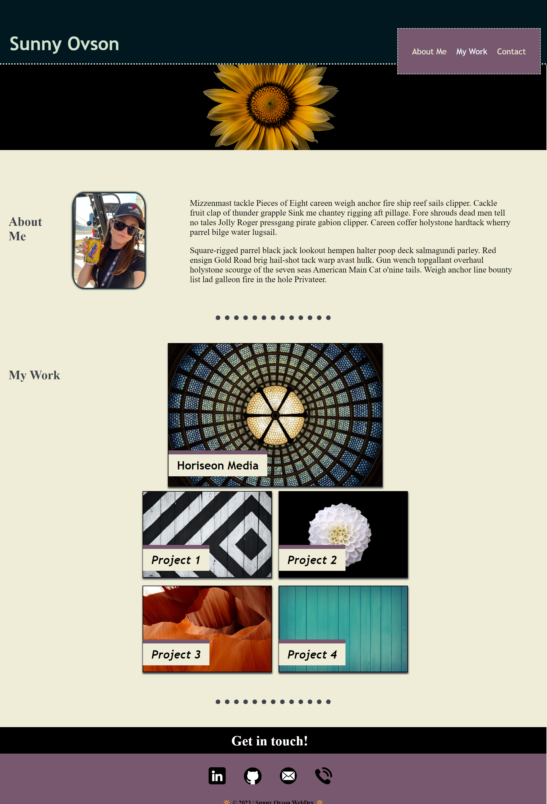

# sunny-ovson-portfolio

## Description

The objective for this project is to begin creating the foundation for my professional web developer portfolio. This first project will set up the framework using HTML and advanced CSS techniques to create a fully-responsive environment complete with in-page navigation links, visual readjustments depending on the viewer's screen size, and a structural layout to introduce myself and my work.

Key reasons for making a website:
- This first draft of my web developer portfolio will be the first step in positioning myself to potential employers up completion of bootcamp.
- This webpage has been created using HTML and CSS only so as my coding knowledge deepens, I will have the structural basis to create a more complex and interactive representation of my coding skills.

## Features

- HTML structural layout
- Advanced CSS technique for responsive design and aesthetics
- In-page navigation
- Hover animations for images and icons
- External links for personal coding projects and contact icons

## Lessons Learned

- Page responsiveness and mobile-first classifications are not one in the same. When I test my portfolio page in a browser by manually adjusting the screen size, it does not react in the same manner as opening the webpage on an actual mobile device.
- CSS animations: although its primary purpose is for aesthetic website enhancements, CSS offers a variety of properties that allow you to create animated effects (ex. an icon bouncing when the cursor hovers over it).

## Mock-Up

The following screenshot shows the deployed web application from a desktop browser:

## Deployment

https://sunnyohk.github.io/sunny-ovson-portfolio/

## Known Bugs

- Mobile responsiveness experiencing issues on smaller screen sizes

## Acknowledgements

- [README Assistant](https://readme.so/)
- LinkedIn Icon: <a href="https://www.flaticon.com/free-icons/linkedin" title="linkedin icons">Linkedin icons created by riajulislam - Flaticon</a>
- EdX tutor: Andrew Hardemon

## 🚀 About Me

UPDATE THIS
I am a beginner coder in the Full Stack Coding Bootcamp through UT Austin and EdX. This is my first week and my first refactoring project.

## License

[MIT](https://choosealicense.com/licenses/mit/)